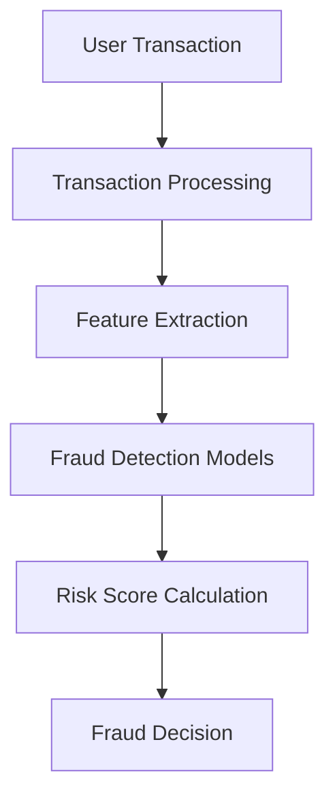

# 04 Block Diagram

The block diagram outlines the linear progression of a transaction from initiation to final decision.

## Visual Flow

## Detailed Block Explanation

### 1. User Transaction
The starting point where a user enters the Receiver ID, Amount, and Remark. Simultaneously, metadata like GPS coordinates (Lat/Lon) and Device Fingerprints are captured.

### 2. Transaction Processing
The system validates the input formats, checks if the user exists in the graph database, and sanitizes the remark text for the NLP model.

### 3. Feature Extraction
Raw signals are transformed:
- **Location**: Calculates distance from "Usual Location".
- **Velocity**: Checks if the distance traveled since the last transaction is physically possible.
- **Device**: Compares current Device ID with the "Registered Device ID".
- **Pattern**: Extracts recent amount sequences for sequence analysis.

### 4. Fraud Detection Models
The data is fed into:
- **XGBoost Classifier**
- **LSTM Sequence Network**
- **NLP Text Classifier**
- **Network Graph Engine**

### 5. Risk Score Calculation
All model probabilities are aggregated using a weighted logic:
`Final Risk = (0.35 * Core) + (0.20 * LSTM) + (0.15 * NLP) + (0.30 * Rules)`

### 6. Fraud Decision
Based on the final score:
- **Low Risk (< 0.3)**: Approved (ALLOW)
- **Medium Risk (0.3 - 0.7)**: Challenge (OTP Required)
- **High Risk (> 0.7)**: Rejected (BLOCK)
