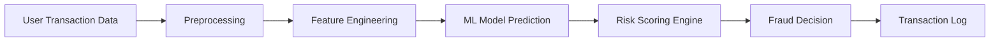

# 06 Data Flow

## Data Path
The flow of data in our system is strictly unidirectional from input capture to decision storage.

## Data Flow Diagram

## Step-by-Step Data Transformation

| Stage | Data Transformed | Output |
| :--- | :--- | :--- |
| **Input Capture** | Raw JSON from Frontend (User ID, Lat, Lon, Device, Remark) | Request Object |
| **Preprocessing** | Text lowercase removal, missing value fill | Cleaned Record |
| **Feature Engineering** | Haversine distance, Velocity check, Burst count | 24-Dimensional Vector |
| **ML Inference** | XGBoost/LSTM/NLP inference | Set of Probabilities |
| **Scoring** | Weighted aggregation of probabilities | Single 0.0 - 1.0 Score |
| **Decision** | Threshold comparison | Status (ALLOW/OTP/BLOCK) |
| **Persistence** | In-memory log update | Live Dashboard Entry |
