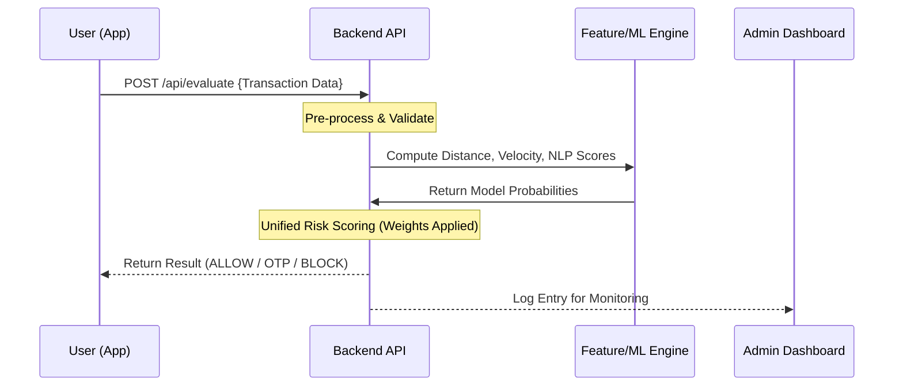

# 13 System Flow

The final end-to-end journey of a UPI packet in the system.

## End-to-End Flow Diagram

## Flow Description

1. **Transaction Trigger**: The User clicks "Pay".
2. **Metadata Enrichment**: The mobile/web client appends hidden metadata (GPS, Device ID) to the payment request.
3. **API Reception**: The FastAPI listener receives the bundle.
4. **Feature Expansion**: The system expands the simple request into 20+ features by looking up historical averages and calculating spatial deltas.
5. **Ensemble Execution**: The ensemble of ML models processes the feature vector simultaneously.
6. **Weighted Reduction**: The scores are compressed into a single probability.
7. **Policy Application**: The decision logic compares the probability against bank-defined thresholds.
8. **Feedback Loop**: The result is sent back to the user, and the entire payload is pushed to the Admin Dashboard for visual analytics.
